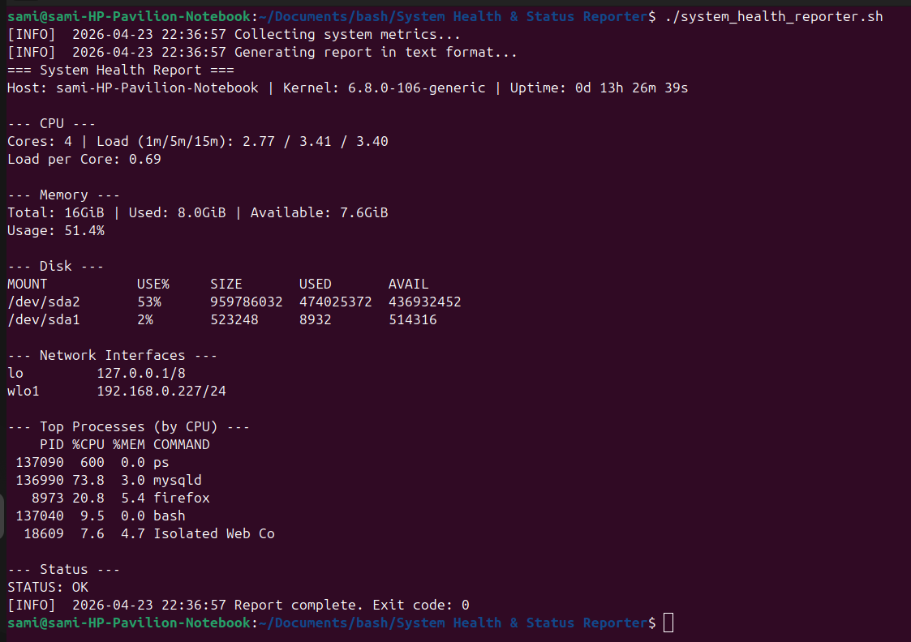
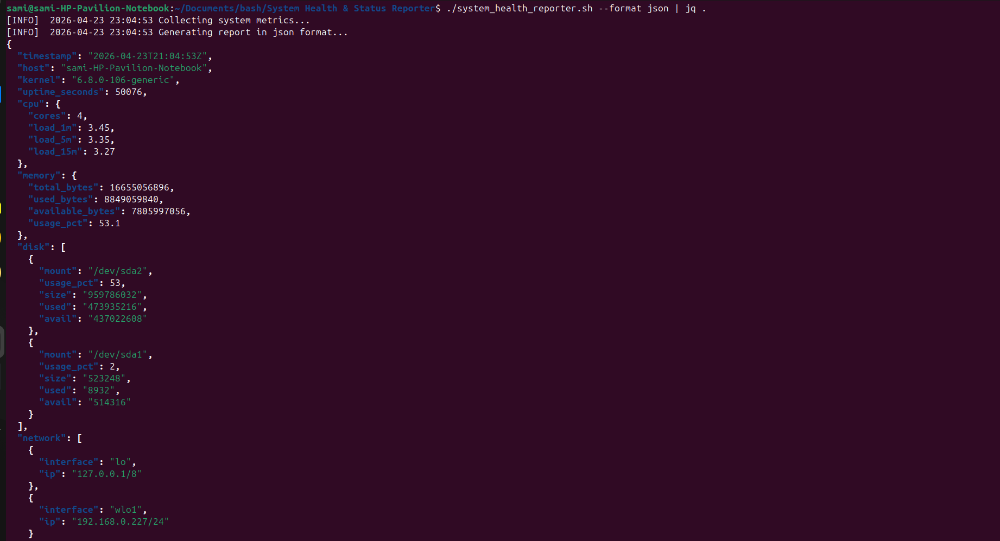
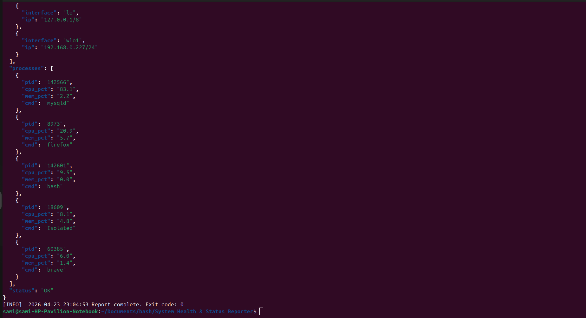

# 🖥️ System Health & Status Reporter

[](https://github.com/Osama-2024-Ahmad/system-health-reporter/actions/workflows/ci.yml)
[](LICENSE)
[](https://www.gnu.org/software/bash/)

A production-ready Bash script that collects CPU, memory, disk, network, and process metrics, evaluates configurable thresholds, and outputs structured reports in **text** or **JSON** format. Designed for cron jobs, monitoring dashboards, or manual diagnostics.

> ✅ Exit codes follow Nagios/Icinga convention: `0=OK`, `1=WARNING`, `2=CRITICAL`

---

## ✨ Features

- 📊 **Multi-format output**: Human-readable text or machine-parseable JSON
- 🎯 **Threshold-based alerting**: Configurable warnings for disk, memory, and CPU load
- 🔒 **Safe by design**: `set -euo pipefail`, explicit error handling, `stderr` logging
- 🌍 **Locale-independent**: Forces `LC_ALL=C` to avoid decimal separator bugs
- 🧹 **Clean dependencies**: Uses only standard Linux utilities (`awk`, `df`, `free`, `ps`, `ip`)
- 🔄 **Cron-friendly**: Structured output to `stdout`, logs to `stderr`, meaningful exit codes

---

## Project Structure

```
.
├── system_health_reporter.sh
├── Makefile
├── .shellcheckrc
└── docs
    └── screenshots
```

---

## Installation

```
git clone https://github.com/yourusername/system-health-reporter.git
cd system-health-reporter
chmod +x system_health_reporter.sh
```

---

## Usage

Run default report

```
./system_health_reporter.sh
```

Run JSON output

```
./system_health_reporter.sh --format json
```

Pretty print JSON

```
./system_health_reporter.sh --format json | jq .
```

Dry run

```
./system_health_reporter.sh --dry-run
```

Check exit code

```
./system_health_reporter.sh
echo $?
```

---

## Output Examples

### Text Output



---

### JSON Output





---

### Manual Tests


---

## Manual Tests Commands

Check text output

```
./system_health_reporter.sh | grep "STATUS:"
```

Validate JSON

```
./system_health_reporter.sh --format json | python3 -m json.tool > /dev/null && echo "Valid JSON"
```

Check exit code

```
./system_health_reporter.sh >/dev/null 2>&1
echo $?
```

---

## What It Reports

- CPU load and cores  
- Memory usage in bytes and percent  
- Disk usage per mount  
- Network interfaces with IP  
- Top processes by CPU  
- Final system status  

---

## Exit Codes

- 0 system is healthy  
- 1 warning threshold reached  
- 2 critical threshold reached  

---

## Use Cases

- Cron jobs  
- Monitoring scripts  
- Server diagnostics  
- CI checks  

---

## License

MIT
